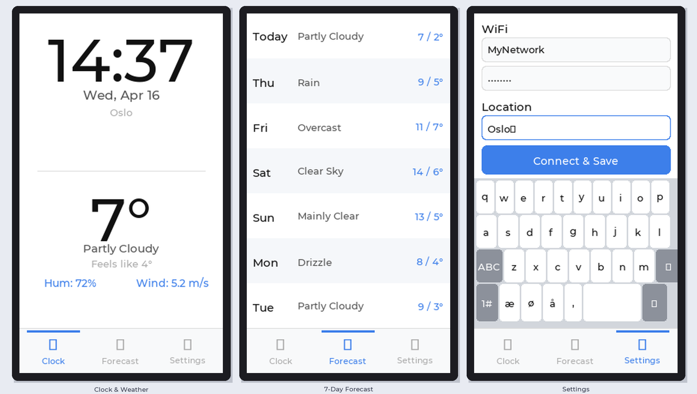

# ESP32 DeskClock

A clean, touch-enabled desk clock for the **JC4827W543** development board (ESP32-S3, 4.3″ display). Shows the time, current weather, and a 7-day forecast. No cloud account or API key required.



---

## Features

- **Large clock** — time displayed at 92 px, fills the top half of the screen
- **Live weather** — temperature, feels-like, humidity, wind speed via [Open-Meteo](https://open-meteo.com/) (free, no key)
- **7-day forecast** — scrollable daily hi/lo and conditions
- **Capacitive touch** — full GT911 touch support, 3-tab navigation
- **On-device settings** — enter WiFi and city directly on the touchscreen keyboard
- **Norwegian keyboard** — æ ø å / Æ Ø Å included on the keyboard
- **Auto timezone** — UTC offset derived from weather data, no manual config
- **Web installer** — flash directly from Chrome/Edge, no IDE needed

---

## Hardware

| Component | Detail |
|-----------|--------|
| Board | JC4827W543 |
| SoC | ESP32-S3, 240 MHz dual-core |
| Display | 4.3″ NV3041A, 480 × 272, QSPI |
| Touch | GT911 capacitive, I²C |
| Flash | 4 MB |
| PSRAM | 8 MB OPI |

---

## Screens

### Clock + Weather
The top half shows the current time (large), date, and city name.  
The bottom half shows temperature, weather description, feels-like, humidity and wind speed.

### 7-Day Forecast
Day name, weather condition, and daily high/low for the next 7 days.

### Settings
On-screen keyboard with WiFi SSID, password, and city name fields.  
Tap **Connect & Save** — the device connects to WiFi, syncs time via NTP, geocodes the city, fetches weather, and applies the correct timezone automatically.

---

## Flash via Web Installer

**No drivers or IDE needed.** Requires Chrome or Edge.

👉 **[Open Web Installer](https://frogswiper.cloud/esp32-deskclock)**

1. Plug in the JC4827W543 via USB
2. Click Install and select the COM port
3. Wait ~30 seconds for flashing to complete
4. On the device, open the **Settings tab** (⚙ bottom right)
5. Enter WiFi credentials and your city name
6. Tap **Connect & Save**

---

## Build from Source

### Requirements

- [PlatformIO](https://platformio.org/)
- Python 3 (for the merge-binary post-build script)

### Build & flash

```bash
cd firmware
pio run -t upload
```

PlatformIO will automatically download all dependencies on the first build:

| Library | Version |
|---------|---------|
| LovyanGFX | ≥ 1.2.7 |
| LVGL | 8.3.11 |
| ArduinoJson | ^7.0.0 |
| TouchLib (mmMicky) | latest |

After a successful build, `web-installer/firmware-merged.bin` is updated automatically by the post-build script.

---

## Project Structure

```
esp32-deskclock/
├── firmware/
│   ├── platformio.ini
│   ├── lv_conf.h
│   └── src/
│       ├── main.cpp              # Setup + main loop
│       ├── display.cpp           # LovyanGFX + LVGL init, GT911 touch
│       ├── settings.cpp/h        # NVS-backed settings (Preferences)
│       ├── weather.cpp/h         # Open-Meteo API
│       ├── wifi_manager.cpp/h    # WiFi + geocoding
│       ├── ntp.cpp/h             # NTP + timezone
│       ├── font_clock_92.c       # Generated 92 px Montserrat (digits only)
│       ├── font_montserrat_14_nor.c  # Montserrat 14 + ÆØÅæøå
│       └── ui/
│           ├── ui_main.cpp/h     # Tab container + bottom nav bar
│           ├── ui_clock.cpp/h    # Clock + weather tab
│           ├── ui_forecast.cpp/h # 7-day forecast tab
│           └── ui_settings.cpp/h # Settings + keyboard tab
└── web-installer/
    ├── index.html
    ├── manifest.json
    └── firmware-merged.bin
```

---

## Configuration

All settings are stored in NVS and entered on the device. There is nothing to configure at compile time.

| Setting | Description |
|---------|-------------|
| WiFi SSID | Your network name |
| WiFi Password | Your network password |
| City | City name used for geocoding (e.g. `Oslo`, `Bodø`, `Tromsø`) |

Latitude, longitude, and UTC offset are resolved automatically.

---

## Dependencies & Licences

- [LovyanGFX](https://github.com/lovyan03/LovyanGFX) — MIT
- [LVGL](https://lvgl.io/) — MIT
- [ArduinoJson](https://arduinojson.org/) — MIT
- [TouchLib](https://github.com/mmMicky/TouchLib) — MIT
- [Open-Meteo](https://open-meteo.com/) — free, non-commercial use
- Montserrat font — [SIL Open Font License](https://scripts.sil.org/OFL)
